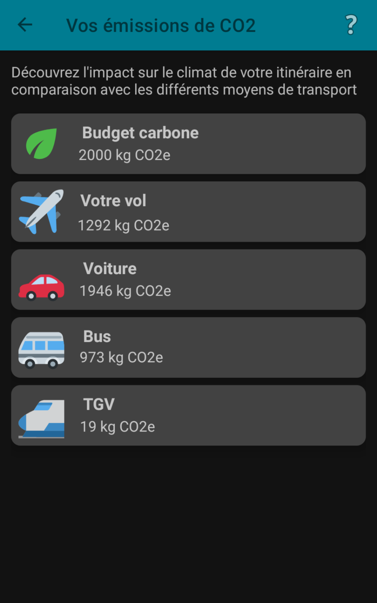

# Fly Co2 Tracker 

## Description

This app allows you to calculate in a very simple way the carbon footprint of a flight itinerary.
The algorithm used for the calculations is open source & created by futur eco: https://github.com/laem/futureco-data/blob/master/data/avion.yaml

The list of airports and their relative information are available [here](https://raw.githubusercontent.com/jpatokal/openflights/master/data/airlines.dat)

## Dependencies

The following components from the Jetpack library are used :
- ViewModel
- LiveData
- Data Binding
- Navigation
- Safe Args
- Coroutines

## Screenshots

 
 
 
 